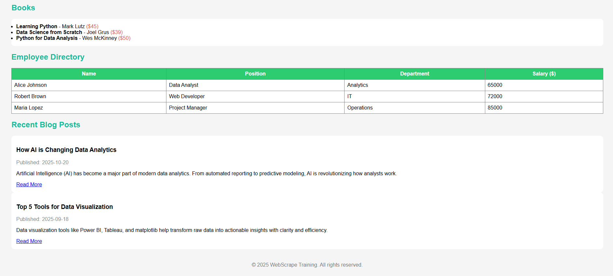

# 📘 Project 1 — Practice Webpage Scraping

### 🧩 Overview
This is the **first project** in my *Web Scraping Practice Projects* series.  
It uses a **locally created, AI-generated webpage** (`web.html`) that mimics a small e-commerce and blog website.

This project was built **purely for learning and ethical educational purposes** —  
no real websites or copyrighted data were scraped.

## 🌐 Sample Webpage Preview





### 🎯 Objectives
- Understand how to parse HTML using **BeautifulSoup**.  
- Practice selecting elements using tags, classes, and nested structures.  
- Convert extracted data into a structured format (using **Pandas DataFrames**).

---

## 🧠 Files in This Project

| File / Folder | Description |
|----------------|--------------|
| **web.html** | Mock webpage containing product, book, employee, and blog data. |
| **scraping_practice.ipynb** | Jupyter Notebook with all scraping and data extraction code. |
| **screenshots/** | Contains screenshots of webpage and output samples. |

---

## 🧰 Libraries Used

```bash
pip install beautifulsoup4
pip install lxml
pip install pandas
```

## 🧑‍💻 Sample Code Snippets

### Reading and parsing the HTML

```python
from bs4 import BeautifulSoup

with open("web.html", 'r') as f:
    contents = f.read()

soup = BeautifulSoup(contents, 'lxml')
print(soup.prettify())
```
### Extracting all product links

```python
prod = soup.find_all(class_='link')
for p in prod:
    print(p.text)
```
### Extracting employee table into a DataFrame

```python
import pandas as pd

table = soup.find('table')
headers = [th.text.strip() for th in table.find_all('th')]

rows = table.find('tbody').find_all('tr')
data = [[td.text.strip() for td in row.find_all('td')] for row in rows]

df = pd.DataFrame(data, columns=headers)
print(df)
```
### Scraping recent blog posts

```python
recent_blogs = soup.find_all('div', class_='blog')
blog_data = []

for blog in recent_blogs:
    title = blog.find('h3', class_='title').text.strip()
    date = blog.find('p', class_='date').text.strip()
    text = blog.find('p', class_='content').text.strip()
    link = blog.find('a', class_='readmore')['href']
    blog_data.append([title, date, text, link])

df_blogs = pd.DataFrame(blog_data, columns=['Title', 'Date', 'Text', 'Link'])
print(df_blogs)
```
## 📊 Example Outputs

Below is a sample of how the scraped **blog data** looks after being extracted into a Pandas DataFrame.

| Title | Date | Text (summary) | Link |
|-------|------|----------------|------|
| How AI is Changing Data Analytics | 2025-10-20 | Artificial Intelligence (AI) has become... | https://example.com/blog/ai-data |
| Top 5 Tools for Data Visualization | 2025-09-18 | Data visualization tools like Power BI... | https://example.com/blog/visualization-tools |

> *(See the screenshots folder for the complete notebook output and webpage preview.)*

---

## ⚖️ Legal & Ethical Notice

> **⚠️ Important:**  
> This project scrapes **only a locally created HTML file** for educational purposes.  
> No real websites, APIs, or external data sources were accessed.

### ✅ If you scrape real websites in the future, always ensure:
1. You check and respect the site’s **robots.txt** file.  
2. You **do not scrape login-protected or private data**.  
3. You **give credit** if data is displayed or reused publicly.  
4. You scrape only **publicly available, non-sensitive data**.  

> 💡 *When in doubt — contact the site owner or use a public API instead.*

---

## 🚀 Future Plans

- Try scraping **public, open-data** sites like books or datasets.  
- Learn **API-based extraction** (safer and faster).  
- Perform **data cleaning and visualization** on scraped results.

---

## 🧾 Author

**Shabin P K**  
Learning Data Analytics & Web Scraping | 2025  

---

